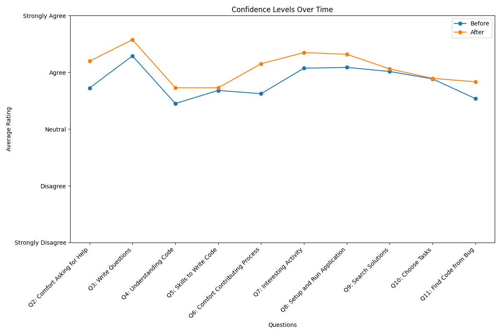

# Before and After Impression

This code will generate the before after impression regarding the contribution in the Open Sources based on the CSV file
containing few questionnaire

## How to Run

1. Set your virtual env
2. Install the required libraries:
    ```sh
    pip install -r reqirements.txt
    ```
3. Run the script:
    ```sh
    python src/generate_overall_impression.py
    python src/generate_my_impression.py
    ```

This will generate the following charts and save them in the `result` directory:

### Overall Confidence Levels Over time



### Overall Before and After Contribution Comparison:


### My Before and After Contribution Comparison:


# My answers regarding the Expectation and Impression

| Q.N. | Question                                                   | Before               | After                | Change |
|------|------------------------------------------------------------|----------------------|----------------------|--------|
| 1    | Challenges Expected vs. Encountered                        | Predicted Challenges | Faced More challenge | Yes    |
| 2    | Comfort Asking for Help                                    | Strongly agree       | Strongly agree       | No     |
| 3    | Writing Questions and Understanding Answers in English     | Strongly agree       | Strongly agree       | No     |
| 4    | Understanding Code Written by Others                       | Strongly agree       | Strongly agree       | No     |
| 5    | Skills to Write and Change Code                            | Strongly agree       | Strongly agree       | No     |
| 6    | Comfort with Contributing Process                          | Agree                | Strongly agree       | Yes    |
| 7    | Interest in Contributing to Open Source                    | Strongly agree       | Strongly agree       | No     |
| 8    | Setting Up and Running Applications with Instructions      | Strongly agree       | Strongly agree       | No     |
| 9    | Searching for Solutions and Understanding Technical Issues | Strongly agree       | Strongly agree       | No     |
| 10   | Choosing Adequate Tasks to Fix                             | Strongly agree       | Agree                | Yes    |
| 11   | Finding Code to Fix Given a Bug Report                     | Strongly agree       | Strongly agree       | No     |


Here is my before/after Expectation and Impression answers, for each radio button these are the
**Options:** Strongly disagree, Disagree, Neutral, Agree, Strongly agree

### Before

**Question 1: What challenges do you expect to encounter when trying to make a source code contribution to an Open
Source project?**

**Your Answer:**
I am expecting the following challenges:

- Understanding the project will be a big challenge.
- PR not getting through.
- Finding a good issue to work on to make a sizable contribution.
- Different coding practices and norms.
- Delay in receiving a response from the repo's author.
- Long-winding discussion even before being able to work on some ticket.
- Understanding reported issues might be challenging as they might not be easily reproducible.
- Testing the code and making sure it does not break other parts of the code.

**Question 2: I feel comfortable asking for help from the Open Source community using electronic communication means.**

**My Answer:** Strongly agree

**Question 3: I can write my questions and understand answers in English.**

**My Answer:** Strongly agree

**Question 4: I am good at understanding code written by other people.**

**My Answer:** Strongly agree

**Question 5: I have pretty good skills to write and change code.**

**My Answer:** Strongly agree

**Question 6: I feel comfortable with the process of contributing to an Open Source project.**

**My Answer:** Agree

**Question 7: I think that contributing to an Open Source software project is an interesting activity.**

**My Answer:** Strongly agree

**Question 8: I feel I can set up and run an application if a set of instructions is properly given.**

**My Answer:** Strongly agree

**Question 9: I am pretty good at searching for solutions and understanding technical issues by myself.**

**My Answer:** Strongly agree

**Question 10: I can choose an adequate task to fix if a list of tasks is given.**

**My Answer:** Strongly agree

**Question 11: I can find the piece of code that needs to be fixed given a bug report presenting the issue.**

**My Answer:** Strongly agree

### After

**Question 1: What challenges did you encounter when trying to make a source code contribution to an Open Source
project?**

**Your Answer:**
There are the challenges that we faced while contributing:

- Understanding the project was challenging.
- Not all PRs got through.
- Finding a good issue to work on to make a sizable contribution.
- Different coding practices and norms.
- Delay in receiving a response from the repo's author.
- Long-winding discussion even before being able to work on some ticket.
- Understanding reported issues might be challenging as they might not be easily reproducible.
- Testing the code and making sure it does not break other parts of the code.

Moreover, the repo we were contributing to (litellm) only has two authors, and there are far too many open issues and
PRs all the time. I think they don't have enough time to clean that up. Therefore, the older issues, if picked up,
likely do not have any importance to them anymore. There are usually 100 PRs in open status and 400+ issues.

We initially thought it was a Python package; however, the same repo is being used to create a Python package, proxy
server, docs, website, etc. This is a big monolithic repo, and getting started or understanding became much harder.
Based on the code that is there, I can say for sure, the code quality and standard were not considered a priority. It
was hard to explain what a code does and does not in one PR to the authors. I had to agree to their request rather than
making the right decision.

Since the authors are using the repo to generate revenue by creating a paid enterprise service using it, they are mostly
interested in adding more features rather than maintaining the code and making the system better. One example is that
they will add any feature request someone asks rather than thinking deeply about whether it will have breaking changes
or not. They are open to adding a call to the prospect buyer rather than talking to the developer/contributors. Test,
developer guidance, documentation, code quality, and standards are all poor. However, I find the authors actively
engaged.

Often, the issues/tickets are poorly written, just a few lines usually. Understanding them and replicating or addressing
them requires you to know everything about the codebase and applications. Getting feedback and guidance from the authors
was hard because they sometimes take days to respond, and usually, it is not enough for newcomers to the system.

**Question 2: I feel comfortable asking for help from the Open Source community using electronic communication means.**

**My Answer:** Strongly agree

**Question 3: I can write my questions and understand answers in English.**

**My Answer:** Strongly agree

**Question 4: I am good at understanding code written by other people.**

**My Answer:** Strongly agree

**Question 5: I have pretty good skills to write and change code.**

**My Answer:** Strongly agree

**Question 6: I feel comfortable with the process of contributing to an Open Source project.**

**My Answer:** Strongly agree

**Question 7: I think that contributing to an Open Source software project is an interesting activity.**

**My Answer:** Strongly agree

**Question 8: I feel I can set up and run an application if a set of instructions is properly given.**

**My Answer:** Strongly agree

**Question 9: I am pretty good at searching for solutions and understanding technical issues by myself.**

**My Answer:** Strongly agree

**Question 10: I can choose an adequate task to fix if a list of tasks is given.**

**My Answer:** Agree

**Question 11: I can find the piece of code that needs to be fixed given a bug report presenting the issue.**

**My Answer:** Strongly agree